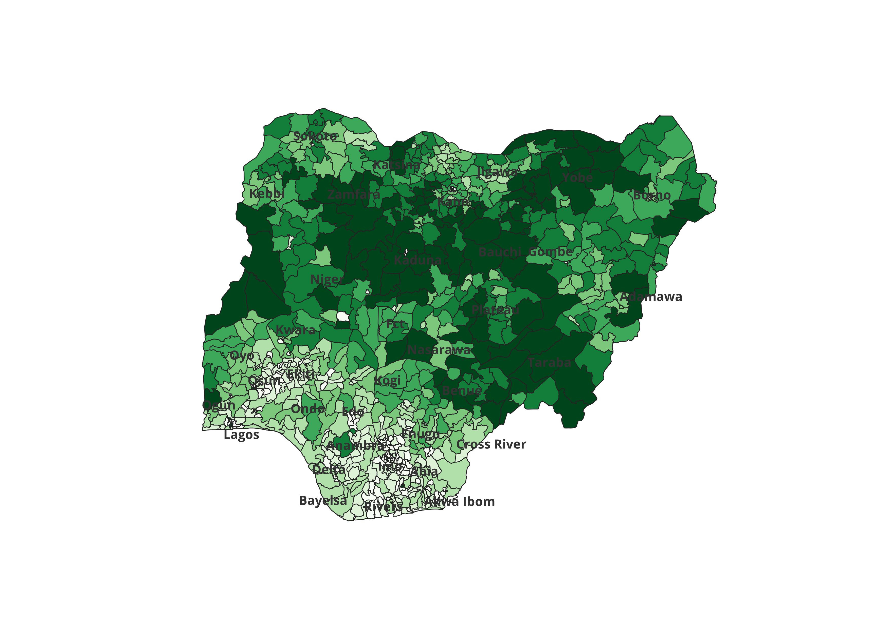

# 🗺️ Nigeria LGA Population Density Map

A geospatial analysis project that maps population density across all 774 Local Government Areas (LGAs) in Nigeria, built entirely in QGIS using open-source spatial and demographic datasets.



---

## 📌 Project Overview

This project integrates multiple geospatial and tabular datasets to produce a choropleth map classifying Nigeria's LGAs into 7 population density classes. It demonstrates a full GIS workflow — from raw data acquisition and spatial joins through to cartographic output and data export.

---

## 📂 Repository Contents

```
nigeria-lga-population-density/
│
├── LGA_Total_Population.jpg   # Final choropleth map (exported from QGIS)
├── LGA.sqlite                 # Spatial database: LGA boundaries + joined attributes
├── Population_NGA.xlsx        # Tabular population data (source: Geopode)
└── README.md
```

---

## 🔄 Workflow

### 1. Data Acquisition
All source datasets were downloaded from open public repositories:

| Dataset | Source | Format |
|---|---|---|
| Nigeria Population Data | [Geopode](https://geopode.world/NGA) | Tabular |
| Health Facility Data | [GRID3 Nigeria](https://grid3.org/geospatial-data-nigeria) | Shapefile |
| State & LGA Boundaries | [GRID3 Nigeria](https://grid3.org/geospatial-data-nigeria) | Shapefile |
| Settlement Extent | [GRID3 Nigeria](https://grid3.org/geospatial-data-nigeria) | Raster/Vector |

### 2. Spatial Join — Settlement Extent × LGA Layer
The settlement extent layer was spatially joined to the LGA boundary layer to associate each settlement polygon with its corresponding LGA, enabling aggregation of settlement coverage per LGA.

### 3. Attribute Join — LGA Layer × Population Data
The Geopode tabular population data (`.xlsx`) was joined to the LGA spatial layer using a common LGA identifier field, attaching demographic attributes to each LGA polygon.

### 4. Choropleth Map — Population Density by LGA
The LGA layer was symbolized using a **graduated colour scheme** (light to dark green) with population values classified into **7 classes** using natural breaks (Jenks). State labels were added for geographic reference.

### 5. Data Export
- Spatial data exported as **`.sqlite`** for portability and future GIS use
- Tabular population data retained as **`.xlsx`** for downstream analysis

---

## 🗺️ Map Interpretation

The choropleth map reveals clear spatial patterns in Nigeria's population distribution:

- **North-central and northeastern zones** (Kano, Kaduna, Borno corridors) show the darkest shading, indicating the highest population concentrations
- **Southern states** (Rivers, Lagos, Anambra) show dense but more fragmented LGA-level populations due to smaller LGA sizes
- **Northwestern states** (Kebbi, Zamfara) and parts of the **Middle Belt** show mid-range densities
- **Bayelsa and parts of Cross River** appear lightest, reflecting lower total LGA populations

---

## 🛠️ Tools & Technologies

| Tool | Purpose |
|---|---|
| **QGIS** | Spatial joins, attribute joins, symbolization, map export |
| **Geopode** | Nigeria LGA population data source |
| **GRID3** | Authoritative Nigeria boundary and settlement data |
| **SQLite** | Portable spatial data export format |

---

## ⚙️ How to Reproduce

1. Download and install [QGIS](https://www.qgis.org/download/)
2. Download the source datasets from the links in the table above
3. Load the LGA boundary shapefile into QGIS
4. Perform a **Spatial Join**: Settlement Extent → LGA layer
5. Perform an **Attribute Join**: `Population_NGA.xlsx` → LGA layer (join on LGA name/code)
6. Symbolize the LGA layer using **Graduated** renderer → 7 classes → green colour ramp
7. Export the map layout as an image
8. Export the final layer via **Layer → Export → Save Features As → SQLite**

---

## 👤 Author

**Oluwatobi Abubakar**  
Data Science & GIS Analyst  
GitHub: [@Oluwatobi-abu](https://github.com/Oluwatobi-abu)
